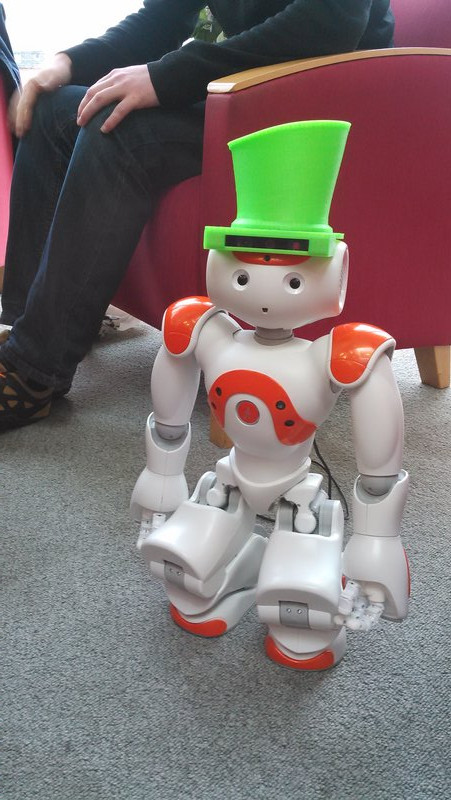
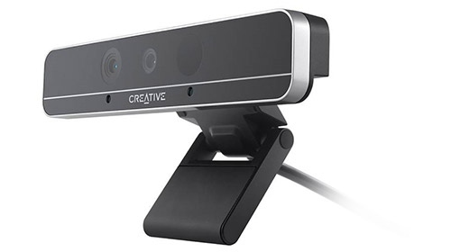
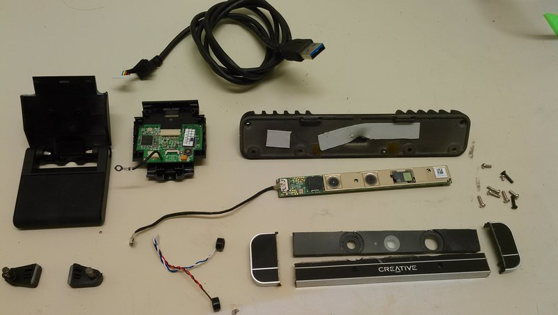
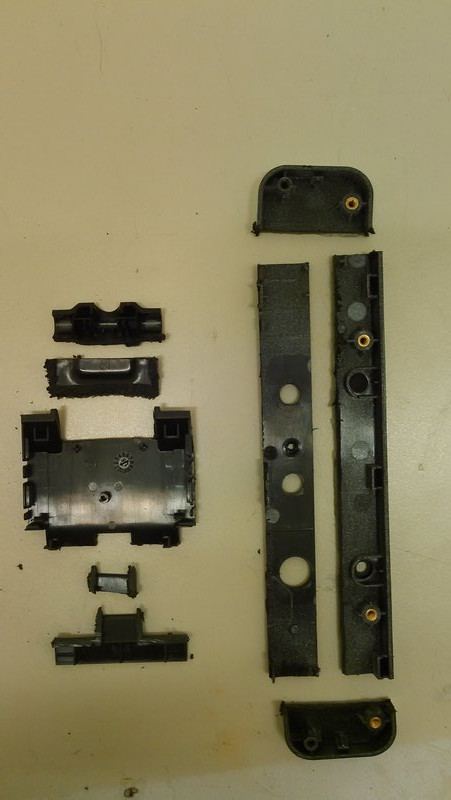
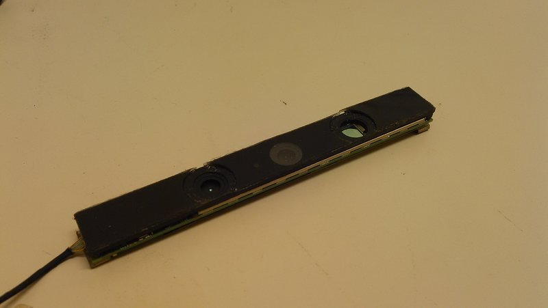
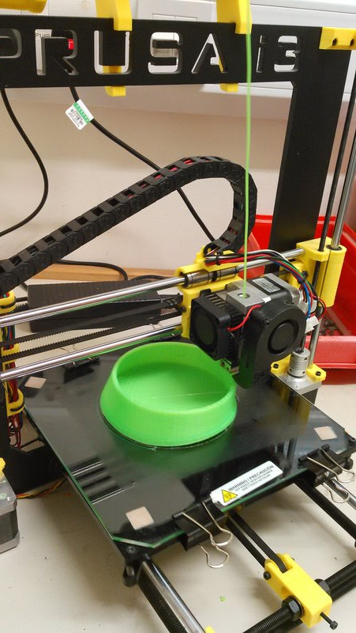
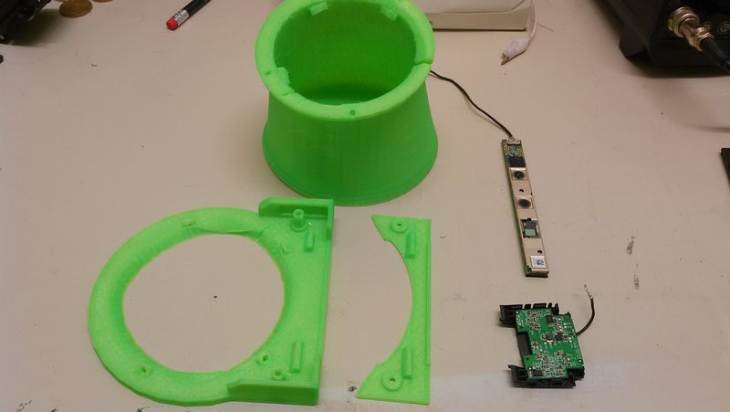
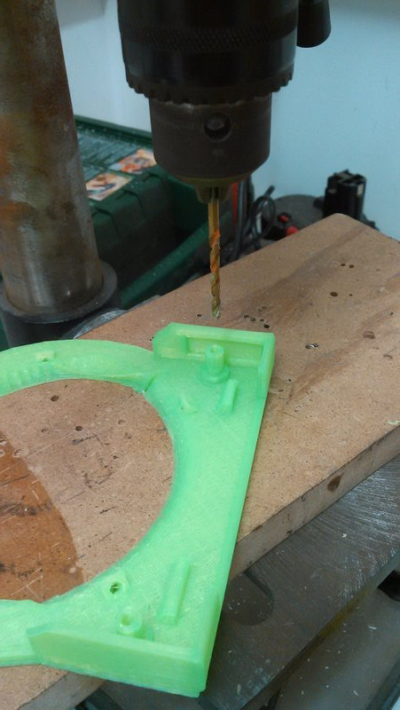
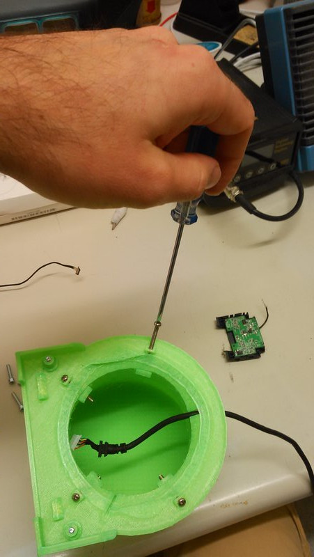
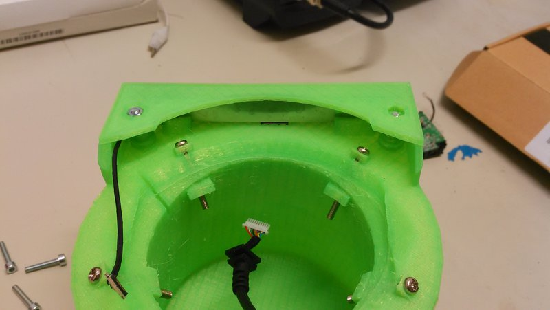

# Nao's Magic Hat

[Nao](https://en.wikipedia.org/wiki/Nao_%28robot%29) is a cute little robot,
quite useful in robotic research. But its vision is quite limited, and does not
allow depth sensing since it does not feature a stereo-vision pair or an RGBD
camera.

This little project aims at 'fixing' that by making a good looking holder for an
RGBD camera, that would even turn Nao into a smart-looking robot!

## What do you need?

- a 3D printer (+ patience!)
- an [Intel F200 RGBD
  camera](http://click.intel.com/intel-realsense-developer-kit.html) (assuming
  the dimensions remain the same, it
  *should* work as well with the soon-to-be-released F200 successor, the [Intel
  SR300](http://click.intel.com/intelrrealsensetm-developer-kit-featuring-sr300.html))
- 6 M3 bolts (4x25mm long, 2x15mm long) + nuts
- a drill with a 3mm drill bit (or a sharp screwdriver!)
- a bit of velcro
- small screwdrivers + a hacksaw or similar

## Step-by-step procedure

Remove the 6 screws (most of them are hidden behind pieces of rubber). The
housing can then easily be removed to give access to the imaging sensor bar.
Unplug the bar.

Open the camera stand by first unscrewing 4 little screws directly on the top
hinge, and then by opening the upper section of the stand (I had to break the
hinge, although it should be possible to open it without breaking anything).

Unplug the microphones and USB cable from the USB adapter PCB. You should end up
with something like this:

Using the hacksaw, cut the front lid to keep only a rectangular piece that
covers the sensor bar. Note that the circlar protectors of the RGB camera and
the IR LED are made of glass! I had to remove them completely. Also, trim the
plastic part that holds the USB PCB, only keeping the plastic clips that are
convenient to hold the board:

The sensor bar can now be covered with the cut piece of the front housing:

Then, print the 3 parts of the hat:

- the [top of the hat](stl/hat-top.stl)
- the [brim of the hat](stl/hat-bottom.stl)
- the [bottom cover](stl/hat-bottom-cap.stl)

I did it on a [Prusa i3](http://prusaprinters.org/prusa-i3/), and it took
about 9 hours in total...

You will end up with these parts:

Then, you have to drill into some of the screw holes to remove the thin layer of
printed plastic that was needed for printing:

Then, assembly. First, screw the top part to the brim, without forgetting to
first insert the USB cable in the slit at the back of the hat:

Then, place the sensor bar (be careful with the orientation of the bar: the
trailing cable goes in the recess printed on the side) and screw on the cover:

The USB adapter board goes inside the top hat (it can be fixed with a bit of
velcro). Plug it in, and you're done!

You can eventually use thin strips of velcro to ensure the hat remains in place when Nao is
moving its head.

## Software

Check [librealsense](https://github.com/IntelRealSense/librealsense) to access
(in a cross-platform way) the RGB and registered depth streams for the camera.

Happy hacking!

